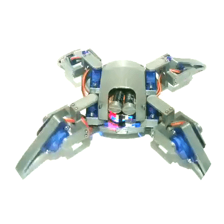

    <!--style="border-radius: 25pc;"-->
<h1>Dibop | IoT NodeMCU robot</h1>

> This <a href="https://flutter.dev">Flutter</a> project aims to develop an app to control the open source code <a href="https://pt.aliexpress.com/item/4001217136927.html?spm=a2g0s.9042311.0.0.5ad9b90a2Ll0a8">R1 quadruped mg90s  NodeMCU robot</a> using IoT in an intuitive fun experience.

> The IoT module was added in the open <a href="https://github.com/jclizar/flutter_IoT_nodeMCUrobot/blob/main/arduino/firmware_dibop.ino">source code</a> using <a href="https://www.arduino.cc/en/software">Arduino IDE</a>.

<h4>Project details</h4>

* <a href="https://trello.com/">Trello</a> Agile Kanban Board for management
* UI design performed with <a href="https://www.figma.com">Figma</a>
*  <a href="https://code.visualstudio.com/learn/collaboration/live-share">Live Share</a> code collaboration
* <a href="https://mosquitto.org/">Eclipse Mosquitto™</a> MQTT Broker
* Rules
    * Front End: <a href="https://github.com/jclizar/flutter_IoT_nodeMCUrobot/blob/main/rules/FlutterProjetoPratico_parte01_fatec.pdf">Part 1</a>
    * Back End: Part 2 

# YouTube video

Part 1 - Front End Design

 
 

# Subfolder 

> To download a subfolder without cloning the whole project use <a href="https://downgit.github.io/#/home">DownGit</a>.
